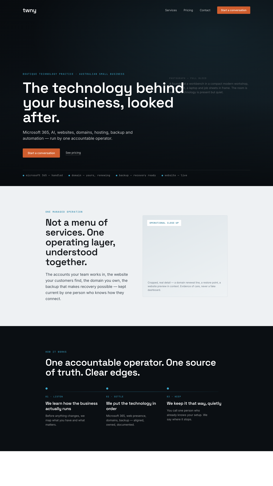
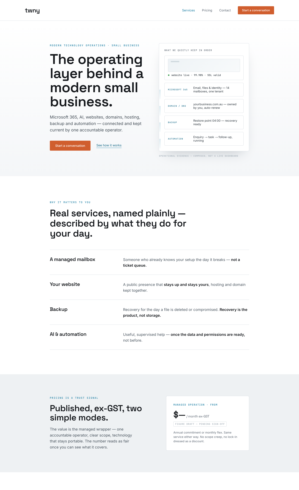
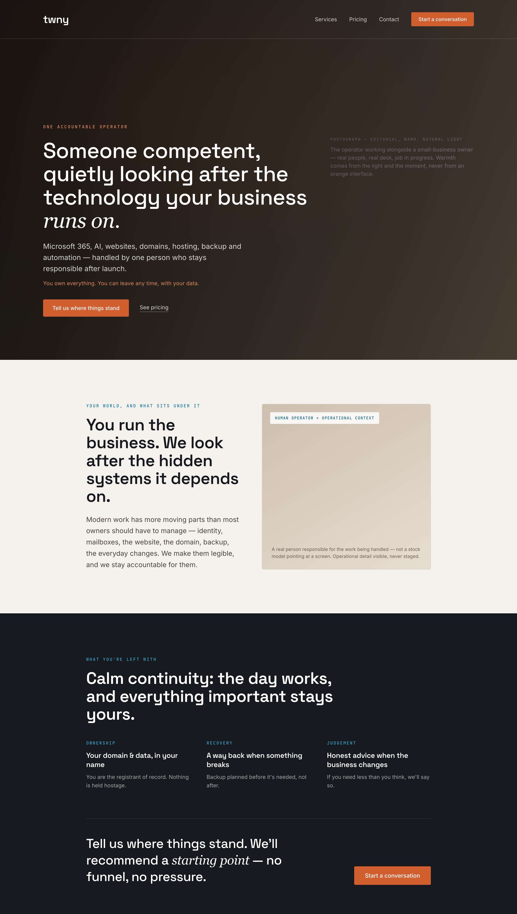

# Homepage V4 — Three Concepts

**Status:** Exploration. Not approved, not implemented. No `src/` files changed.
**Created:** 2026-06-18.
**Reads against:** [`../../governance/creative-direction.md`](../../governance/creative-direction.md) and [`../../governance/art-direction.md`](../../governance/art-direction.md) (updated same day).

> **Superseded in part by the locked direction.** Since these concepts were rendered, the
> governance locked things that override the surface treatments shown here: (1) the brand
> philosophy is **simplification** (internal: *technology is the medium, simplicity is the
> outcome, competence is how*); (2) the canonical brand statement is **"Simplifying the
> technology behind your business."** — used off-page, **never as a homepage H1** — and the
> earlier line "Technology, simplified." is retired as a public brand line (see
> [Brand language](../../governance/creative-direction.md#brand-language)); and (3) the
> visual language is **Ink-first, one continuous environment, with no white or Paper
> sections.** The *emotional registers, narratives, and hero approaches* below remain valid
> inputs, but ignore any light-first surfaces (Concept 2's white/Sand bands, Concept 3's
> warm paper) — all three would now be executed within the Ink-first system, separated by
> lifted-Ink surfaces. The signature component (see Art Direction) is the missing piece none
> of these three fully resolves.

Three distinct, plausible directions for the TWNY homepage. They are not variations on
one layout — they differ in emotional register, visual direction, hero approach, imagery
strategy, narrative sequence, and CTA. The goal is to choose a register before any
implementation begins, per the art direction's **system-before-style** rule.

> **On the renders.** `concept-1.png`, `concept-2.png`, `concept-3.png` are concept
> mockups, not production HTML and not in `src/`. Image regions are *labelled
> placeholders* describing the photography or operational evidence each concept calls for
> — no fabricated photos, clients, logos, or figures, and no reference assets reused. The
> one price shown is rendered as `$—` and flagged **draft**, per the pricing rules. Type
> is shown in a system fallback where the brand webfonts (Space Grotesk / Inter) weren't
> available to the renderer; production uses the real type scale.

All three obey the non-negotiables: first viewport legible as a technology practice,
Atlas substance without Atlas surface, no lifestyle/interiors drift, Ember as the only
decision colour, plain honest copy, no fake proof.

---

## Concept 1 — The Quiet Operator

**Feeling.** Relief and calm authority. *"Someone capable has this; I can stop worrying
about it."* Cinematic, grounded, quietly confident — the register closest to the
emotional core of the brand (the calm of handled technology).

**First viewport.** Near-full-height dark hero over a real environmental photograph (a
founder at work in a compact modern workshop, natural light). Transparent nav resolves on
scroll. Asymmetric content anchored bottom-left: category kicker, a large declarative H1,
one supporting line, one Ember CTA + a quiet "See pricing." A single hairline status row
("microsoft 365 — handled · domain — yours · backup — recovery ready · website — live")
is the *only* technology cue — restrained, not a dashboard.

**Headline direction.** *"The technology behind your business, looked after."* Plain,
human, category-clear in the supporting line.

**Imagery direction.** One arresting environmental hero, then sparing operational
close-ups (a domain renewal line, a restore point, a website preview in context). Dark,
natural-light grade. Photography carries mood; cropped operational detail carries proof.

**Section sequence.** Presence (hero) → one managed operation, not a menu → how it works
(operator method as a calm three-step pathway with Mineral connective line) → trust &
boundaries folded into method → pricing posture (light relief band) → invitation.

**Use of colour.** Dark-first canvas for presence and authority; Sand/Paper relief bands
for proof and pricing so it never becomes a mood tunnel. Mineral carries the connective
pathway. Ember appears only on the single CTA.

**Technology evidence.** Present but quiet: the hairline status row in the hero, then
cropped operational stills. Evidence of *care*, never spectacle.

**Why it avoids Atlas.** The operating loop appears only after the promise, rendered as a
human three-step narrative ("listen → settle → keep"), not a diagram, table, or tenancy
vocabulary.

**Why it avoids lifestyle drift.** The hero is a *working* business scene with a job in
progress and a technology status cue on screen within the first seconds — not an empty
beautiful room. The category is legible immediately.

**Why it converts the right client.** It leads with the exact feeling the buyer is paying
for — calm, handed-over competence — and lowers blood pressure before asking anything.
The wrong-fit price-shopper finds no urgency to grab onto and leaves.

---

## Concept 2 — The Operating Layer

**Feeling.** Current, clear, capably modern. *"This practice understands how a business
actually runs today, and can show me."* Brighter and more structural than Concept 1 —
confidence through legibility rather than atmosphere.

**First viewport.** Light-first, type-led split. Oversized headline left; right is a
*composed* operating-layer artifact — cropped, hairline-connected fragments (a live
website status, Microsoft 365 mailboxes, a domain/DNS ownership line, a backup restore
point, an automation flow) drawn together by Mineral connectors and labelled
"operational evidence — composed, not a live dashboard." Solid nav, Ember CTA.

**Headline direction.** *"The operating layer behind a modern small business."* The
strongest, most immediate category statement of the three.

**Imagery direction.** Less photographic, more editorial-diagrammatic: the hero "image"
*is* the connected operational evidence, rendered with restraint and whitespace.
Supporting photography appears lower as warmth and human context, not as the lead.

**Section sequence.** Operating-layer hero → surface→need truths as editorial rows
(mailbox / website / backup / AI) → pricing as a trust signal (Sand band, draft-flagged
card) → method/operator → invitation.

**Use of colour.** Paper/Sand dominant and bright; Mineral does the heaviest lifting here
as the "technology current" connecting the layer; Ink for type authority. Ember strictly
on the one CTA. Contrast comes from type scale and one dark transition band, not from a
dark theme.

**Technology evidence.** The most explicit of the three — but composed editorially, never
a fake SaaS dashboard. This concept leans hardest into "technology must be visible."

**Why it avoids Atlas.** The evidence panel shows *outcomes and ownership* (your domain,
your recovery point, your live site), not internal architecture, tenancy mechanics, or
the loop. It's the showroom view of the systems, not the engine room.

**Why it avoids lifestyle drift.** There is essentially no room for it to drift — the
category is the hero. The risk runs the other way (toward SaaS/dashboard), which the
composed, hairline, whitespace-led treatment and warmer lower sections deliberately
counter.

**Why it converts the right client.** It answers "what do they actually do?" in three
seconds and makes the connected operation tangible, which justifies a premium over
commodity providers. Pricing-as-trust appears early and honestly.

---

## Concept 3 — The Named Operator

**Feeling.** Human warmth and accountability. *"There is a real, competent person who
takes responsibility for this — and I keep ownership."* Editorial-magazine register;
warmth from natural light and tone, never from an orange interface.

**First viewport.** Warm, dark editorial hero over a photograph of the operator working
alongside a small-business owner. Magazine-style masthead nav. A serif-italic accent in
the headline gives it a distinct, human, authored voice; an ownership reassurance line
sits under the supporting copy; a conversational Ember CTA.

**Headline direction.** *"Someone competent, quietly looking after the technology your
business runs on."* The most human and relationship-led of the three — closest to the
Creative North Star's exact words.

**Imagery direction.** People-forward but disciplined: a real operator-in-context portrait
(not a stock model pointing at a screen), then human + operational close-ups. Warm,
natural-light grade, of a piece with the brand's quiet tones.

**Section sequence.** Operator/relationship hero → your world & the hidden systems under
it → what stays yours (ownership, recovery, judgement) on an Ink band → conversational
invitation. The narrative is escalation by *responsibility*, not by feature.

**Use of colour.** Warm neutral grounds (kept off-beige, tonal not cosy), Ink for an
authoritative close, Mineral for links/labels, Ember on the single CTA only. Warmth is
photographic and tonal, never applied to the UI.

**Technology evidence.** Present but the lightest of the three — operational detail lives
inside the human/portrait compositions and the "what stays yours" band (domain, recovery,
data ownership). This is the concept most at risk on category speed and needs the
strongest technology cue baked into the hero image.

**Why it avoids Atlas.** It centres a person and accountability, not a system. No loop, no
tenancy language, no structural surface.

**Why it avoids lifestyle drift.** The subject is explicitly the *operator and the work*,
with operational context required in every image brief — not a beautiful empty room. The
discipline note in the render's image label enforces this.

**Why it converts the right client.** Boutique buyers buy a person they trust. Naming
accountability and ownership ("you can leave any time, with your data") directly answers
the deepest objection — being locked in or left stranded — and the conversational CTA
suits a one-person decision made alone.

---

## Comparison at a glance

| | **1 — Quiet Operator** | **2 — Operating Layer** | **3 — Named Operator** |
|---|---|---|---|
| Register | Calm / cinematic | Current / structural | Human / editorial |
| Hero | Dark environmental photo | Light type + evidence panel | Warm operator portrait |
| Category speed (3s) | Good | **Strongest** | Needs help from image |
| Atmosphere / feeling | **Strongest** | Moderate | Strong |
| Technology legibility | Quiet | **Explicit** | Lightest |
| Lifestyle-drift risk | Low–moderate | Very low | Moderate (managed) |
| SaaS/dashboard risk | Low | Moderate (managed) | Very low |
| Lead CTA | Start a conversation | Start a conversation | Tell us where things stand |
| Primary buyer pull | Relief | Confidence | Trust |

---

## Recommendation

**Lead with Concept 1 (The Quiet Operator), and absorb Concept 2's hero evidence panel
into its second viewport.**

Reasoning:

- **It hits the Creative North Star most directly.** The brand sells *the feeling that
  someone competent has quietly taken responsibility.* Concept 1's calm authority delivers
  that feeling first, which the governance puts above comprehension — while still naming
  the category in the supporting line and status cue.
- **It is the hardest register to get generic.** A composed dark environmental hero with a
  restrained status cue is the least likely of the three to collapse into an MSP template,
  a dashboard, or an interiors mood piece. It threads the "place between the extremes" the
  art direction defines.
- **It carries the lowest combined risk.** Concept 2 is excellent on category clarity but
  the closest to the SaaS-dashboard failure mode; Concept 3 is the warmest but the slowest
  on the 3-second category test and most dependent on a single perfect photograph. Concept
  1 sits between them.
- **The other two aren't wasted — they're the fixes for Concept 1's weak spots.** Pull
  **Concept 2's composed operating-layer panel** into Concept 1's "what we look after"
  viewport to guarantee category legibility and concrete proof. Pull **Concept 3's named
  accountability and ownership language** ("one person stays responsible," "you can leave
  any time, with your data") into the method and close. The result is Concept 1's feeling,
  Concept 2's proof, and Concept 3's trust.

**Suggested next step (still no implementation):** take the recommended hybrid into the
art direction's required order — settle the **sitemap and section sequence**, then the
**wireframe** (what each section must prove), then **design-system tokens and component
rules** — before any imagery, motion, or `src/` changes. Photography briefs should be
written from the labelled image regions in these renders.
